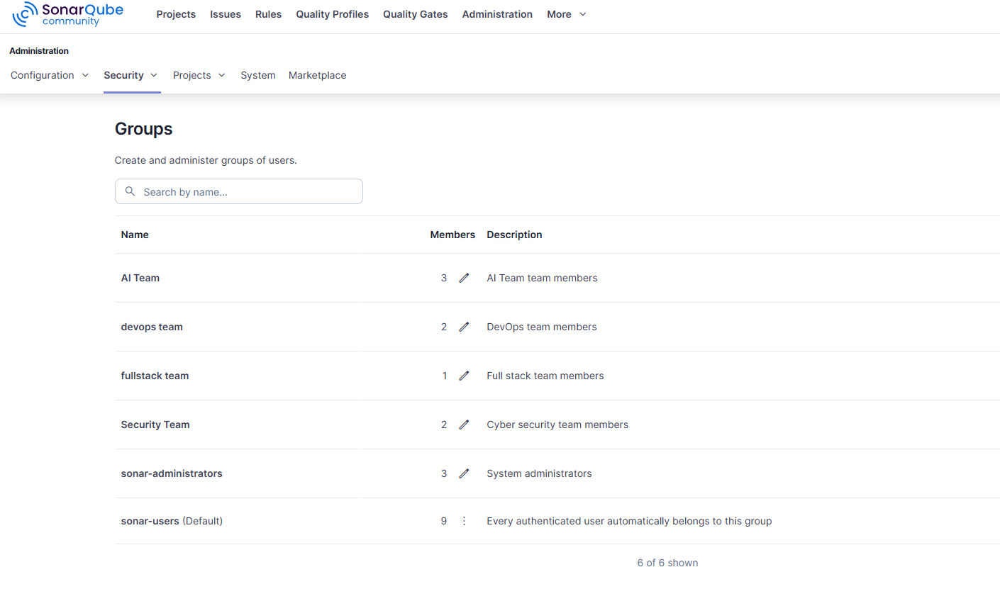
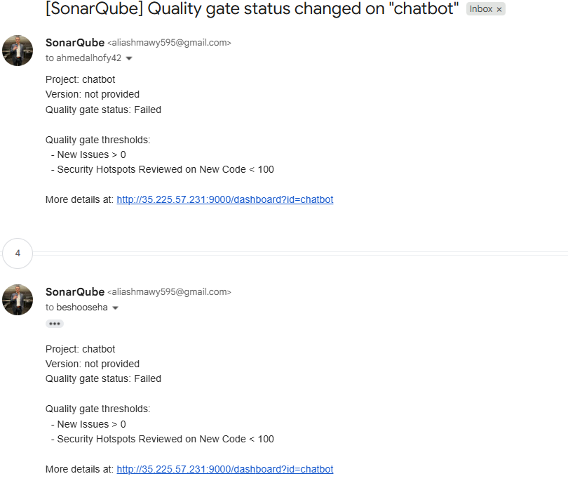
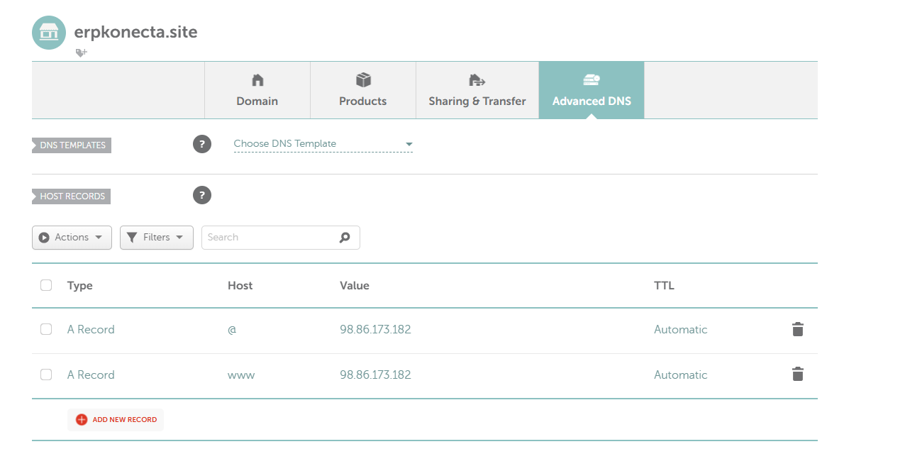

# **DevOps Workflows Documentation**

This directory contains GitHub Actions workflows for the Konecta ERP system's CI/CD pipelines. Each workflow is designed to ensure code quality, security, and automated deployment for different components of the system.

## **Overview**

The DevOps implementation follows industry best practices with automated testing, security scanning, code quality analysis, and containerized deployments. All workflows are designed to be efficient, maintainable, and provide comprehensive coverage of security and quality checks.

## **Workflow Structure**

### **Service-Specific Workflows**

Each major service has its own dedicated workflow file:

- **`authentication-service.yml`** - Authentication service CI/CD pipeline
- **`hr-service.yml`** - HR service CI/CD pipeline
- **`finance-service.yml`** - Finance service CI/CD pipeline
- **`frontend.yml`** - Angular frontend CI/CD pipeline
- **`python-services.yaml`** - Unified workflow for all Python-based services

---

## **Workflow Pipeline Stages**

Each workflow typically includes the following stages:

### **1. Security Scanning (GitLeaks)**

- Detects hardcoded secrets and credentials
- Generates SARIF reports for GitHub Security

### **2. Static Application Security Testing (SAST) - SonarQube**

- Code quality analysis
- Code smells and technical debt identification
- Quality gate enforcement
- Setup SonarQube server credentials for each team member to analyze his own service report



- Send Notification for any major event in each SonarQube project



### **3. Dependency Vulnerability Scanning (OWASP Dependency-Check)**

- Identifies known vulnerabilities in dependencies
- Uploads SARIF to GitHub Security

### **4. Build and Container Scanning**

- Docker image building
- Trivy security scanning (container vulnerabilities)
- SBOM (Software Bill of Materials) generation
- Image push to Docker Hub

### **5. Deployment**

- Automated deployment to AWS EC2
- Docker Compose updates
- Service health checks

### **6. Dynamic Application Security Testing (DAST) - ZAP**

- Runtime security testing
- Web application vulnerability scanning
- Active security assessment

### **Why One Workflow Per Service?**

We maintain separate workflows for each service for the following reasons:

1. **Independent Reports and Artifacts**
    - Each service generates its own security reports, quality gate results, and build artifacts
    - Easier to track issues and metrics per service
    - Clear separation of concerns
2. **Simplified Maintenance**
    - Each workflow can be updated independently without affecting others
    - Easier debugging when issues are isolated to a specific service
    - Service-specific configurations and secrets can be managed separately
3. **Team Collaboration**
    - Different team members work on different services
    - Parallel development without workflow conflicts
    - Independent deployment schedules
4. **Service-Specific Tokens and Secrets**
    - SonarQube generates separate tokens for each project being scanned
    - Each service may require different environment variables and secrets
    - Better security isolation

---

## **Key DevOps Optimizations**

### **1. Using `uv` Instead of `pip` in Python Dockerfiles**

We replaced `pip` with **`uv`** (by Astral) in all Python service Dockerfiles to significantly enhance build speed and efficiency.

**Benefits:**

- **10-100x faster** dependency resolution and installation
- Better dependency conflict resolution
- Lock file support for reproducible builds
- Reduced Docker build time

**Implementation Example:**

```docker
# Install uv for faster dependency installation
COPY --from=ghcr.io/astral-sh/uv:latest /uv /usr/local/bin/uv

# Copy dependency files
COPY pyproject.toml uv.lock ./

# Install dependencies using uv
RUN uv pip install --system --no-cache -r pyproject.toml
```

This optimization has resulted in dramatically faster Python service builds, reducing CI/CD pipeline execution time.

### **2. Caching SonarQube Packages**

Caching SonarQube packages is crucial for reducing workflow execution time. SonarQube scanners download and cache various analysis tools and plugins, which can be time-consuming on every run.

**Cache Configuration:**

```yaml
- name: Cache SonarQube packages
  uses: actions/cache@v4
  with:
    path: ~/.sonar/cache
    key: ${{ runner.os }}-sonar-${{ matrix.service }}
    restore-keys: ${{ runner.os }}-sonar

```

**Why Caching Matters:**

- SonarQube scanner downloads Java runtime and analysis tools
- Plugin downloads and updates are cached
- Significant reduction in network bandwidth usage
- Faster feedback loop for developers

The cache is keyed by operating system and service name, ensuring each service has its own cache while allowing for cache sharing when appropriate.

### **3. Caching OWASP Dependency-Check Database**

OWASP Dependency-Check maintains a local database of vulnerability information that needs to be downloaded and updated regularly. Caching this database saves significant time.

**Cache Configuration:**

```yaml
- name: Cache Dependency-Check database
  uses: actions/cache@v4
  with:
    path: ~/.dependency-check
    key: depcheck-data-${{ runner.os }}-${{ github.run_id }}
    restore-keys: |
      depcheck-data-${{ runner.os }}-

```

**Why Caching Matters:**

- The NVD (National Vulnerability Database) data is large and updates frequently
- Database updates can take several minutes
- Caching reduces download time while maintaining security by using restore keys to ensure recent data

## **Problems Solved and Solutions**

### **Problem 1: `chmod -R 755 /app` Taking Too Long**

**Issue:** When using `chmod -R 755 /app` in Dockerfiles, the operation was extremely slow for large directories, significantly impacting build times.

**Solution:** We restructured the Dockerfile to create the user first, then switch to that user before setting `WORKDIR /app`. This ensures that files created in `/app` are automatically owned by the non-root user without needing explicit `chmod` operations.

**Before:**

```docker
WORKDIR /app
COPY . .
RUN useradd -r -U app && chmod -R 755 /app
USER app

```

**After:**

```docker
RUN useradd -r -U app
USER app
WORKDIR /app
COPY . .

```

**Benefits:**

- No need for recursive `chmod` operations
- Faster Docker builds
- Cleaner, more maintainable Dockerfiles
- Files automatically have correct ownership

### **Problem 2: Repeating Identical Workflows for Python Services**

**Issue:** Initially, each Python service (chatbot, doc_processing, hr_attrition, prophet_forecast, tft_revenue_forecast, cv_parsing) had its own nearly identical workflow file, leading to code duplication and maintenance overhead.

**Solution:** Created a unified workflow (`python-services.yaml`) that uses a matrix strategy. A change detection job automatically identifies which services have been modified and builds a matrix dynamically.

**Implementation:**

```yaml
jobs:
  detect-changes:
    name: Detect Changed Services
# Detects changed service directoriesoutputs:
      services: ${{ steps.set-services.outputs.services }}

  ci-cd-pipeline:
    strategy:
      matrix:
        service: ${{ fromJson(needs.detect-changes.outputs.services) }}

```

**Benefits:**

- Single workflow to maintain
- Automatic change detection
- Parallel execution for multiple services
- Reduced maintenance burden

### **Problem 3: GitLeaks Artifact Upload Conflicts**

**Issue:** After consolidating to a single workflow with matrix strategy, GitLeaks was failing because multiple services tried to upload artifacts with the same name, causing conflicts.

**Error:**

```
Error: An artifact with the same name already exists

```

**Solution:** Disabled automatic artifact upload in GitLeaks configuration and added a separate manual upload step with service-specific artifact names.

**Implementation:**

```yaml
- name: Run GitLeaks Scan
  uses: gitleaks/gitleaks-action@v2
  env:
    GITLEAKS_ENABLE_UPLOAD_ARTIFACT: false# Disable auto-upload- name: Upload GitLeaks report
  if: always()
  uses: actions/upload-artifact@v4
  with:
    name: gitleaks-report-${{ matrix.service }}# Service-specific namepath: results.sarif

```

**Benefits:**

- No artifact name conflicts
- Service-specific artifact names
- Better organization of security reports
- Maintains parallel execution capability

## **SonarQube Configuration**

### **Server Configuration**

SonarQube is accessed via Cloudflare Tunnel, providing secure access to a local instance. The configuration uses:

- **Host URL:** Set via `SONAR_HOST_URL` secret
- **Authentication Token:** Set via `SONAR_TOKEN` secret

### **Optional Improvement: Domain Name Configuration**

If you later configure a domain name (e.g., `sonarqube.groophy.in`), you can replace the Cloudflare tunnel URL with:

```
sonar.core.serverBaseURL=http://sonarqube.groophy.in

```

This makes it easier for users to access SonarQube without remembering IP addresses or tunnel URLs.

**Benefits:**

- Human-readable URLs
- Easier to remember and share
- More professional appearance
- Simplified access management

## **Nginx Reverse Proxy Configuration**

### **Domain Setup**

We purchased a domain name **`erpkonecta.site`** from Namecheap to provide a professional, secure, and memorable way to access the ERP system. The domain is configured with SSL/TLS encryption using Let's Encrypt certificates managed by Certbot.



### **SSL/TLS Encryption with Certbot**

Certbot is used to automatically obtain and renew SSL certificates from Let's Encrypt, ensuring all traffic to the domain is encrypted with HTTPS. The certificates are automatically renewed before expiration, maintaining continuous security.

**Certificate Location:**

- Certificate: `/etc/letsencrypt/live/erpkonecta.site/fullchain.pem`
- Private Key: `/etc/letsencrypt/live/erpkonecta.site/privkey.pem`

### **Nginx Configuration Overview**

The nginx reverse proxy configuration (`nginx/nginx.conf`) serves as a single entry point for all services, routing traffic based on URL paths. This provides several benefits:

1. **Single Domain Access** - All services accessible through one domain
2. **SSL Termination** - Centralized SSL/TLS handling
3. **Load Balancing Ready** - Easy to add multiple backend instances
4. **Security Headers** - Centralized security configuration
5. **Simplified Firewall Rules** - Only port 80/443 need to be exposed

### **Service Routing Configuration**

Each service is configured with a dedicated location block that routes traffic to the appropriate backend service running on localhost:

### **Frontend Application**

**Path:** `/`

**Backend:** `http://127.0.0.1:3000`

**Service:** Angular frontend application

```
location / {
    proxy_pass http://127.0.0.1:3000;
    proxy_http_version 1.1;
    proxy_set_header Upgrade $http_upgrade;
    proxy_set_header Connection 'upgrade';
    proxy_set_header Host $host;
    proxy_set_header X-Real-IP $remote_addr;
    proxy_set_header X-Forwarded-For $proxy_add_x_forwarded_for;
    proxy_set_header X-Forwarded-Proto $scheme;
    proxy_cache_bypass $http_upgrade;
}

```

### **Backend Services**

All backend services follow the pattern `/api/{service_name}/`:

| Service | URL Path | Backend Port | Description |
| --- | --- | --- | --- |
| **Authentication Service** | `/api/authentication/` | `8080` | User authentication and authorization |
| **HR Service** | `/api/hr_service/` | `8081` | Human resources management |
| **Finance Service** | `/api/finance_service/` | `8082` | Financial operations and reporting |

**Example Configuration:**

```
location /api/authentication/ {
    proxy_pass http://127.0.0.1:8080/;
    proxy_http_version 1.1;
    proxy_set_header Upgrade $http_upgrade;
    proxy_set_header Connection 'upgrade';
    proxy_set_header Host $host;
    proxy_set_header X-Real-IP $remote_addr;
    proxy_set_header X-Forwarded-For $proxy_add_x_forwarded_for;
    proxy_set_header X-Forwarded-Proto $scheme;
    proxy_cache_bypass $http_upgrade;
    proxy_read_timeout 300s;
    proxy_connect_timeout 300s;
}

```

### **ML/AI Services**

All machine learning and AI services are grouped under the `/ai/` path prefix:

| Service | URL Path | Backend Port | Description |
| --- | --- | --- | --- |
| **Document Processing** | `/ai/doc_processing/` | `7860` | Document parsing and processing |
| **Chatbot** | `/ai/chatbot/` | `7870` | AI-powered chatbot service |
| **HR Attrition** | `/ai/hr_attrition/` | `7880` | Employee attrition prediction |
| **TFT Revenue Forecast** | `/ai/tft_forecast/` | `7890` | Temporal Fusion Transformer forecasting |
| **Prophet Forecast** | `/ai/prophet_forecast/` | `7900` | Prophet time series forecasting |
| **CV Parsing** | `/ai/cv_parsing/` | `7910` | Resume/CV parsing and extraction |

**Example Configuration:**

```
location /ai/chatbot/ {
    proxy_pass http://127.0.0.1:7870/;
    proxy_http_version 1.1;
    proxy_set_header Upgrade $http_upgrade;
    proxy_set_header Connection 'upgrade';
    proxy_set_header Host $host;
    proxy_set_header X-Real-IP $remote_addr;
    proxy_set_header X-Forwarded-For $proxy_add_x_forwarded_for;
    proxy_set_header X-Forwarded-Proto $scheme;
    proxy_cache_bypass $http_upgrade;
    proxy_read_timeout 300s;
    proxy_connect_timeout 300s;
}

```

### **Security Features**

The nginx configuration includes comprehensive security headers and SSL settings:

**SSL Configuration:**

- TLS 1.2 and 1.3 protocols only
- Strong cipher suites
- SSL session caching for performance
- HSTS (HTTP Strict Transport Security) header

### **Access URLs**

With the nginx reverse proxy configuration, all services are accessible via:

- **Frontend:** `https://erpkonecta.site/`
- **Authentication API:** `https://erpkonecta.site/api/authentication/`
- **HR API:** `https://erpkonecta.site/api/hr_service/`
- **Finance API:** `https://erpkonecta.site/api/finance_service/`
- **Document Processing:** `https://erpkonecta.site/ai/doc_processing/`
- **Chatbot:** `https://erpkonecta.site/ai/chatbot/`
- **HR Attrition:** `https://erpkonecta.site/ai/hr_attrition/`
- **TFT Forecast:** `https://erpkonecta.site/ai/tft_forecast/`
- **Prophet Forecast:** `https://erpkonecta.site/ai/prophet_forecast/`
- **CV Parsing:** `https://erpkonecta.site/ai/cv_parsing/`

## **Best Practices used**

1. **Always use caching** for tools that download data or dependencies
2. **Use matrix strategies** for parallelizing similar jobs
3. **Non-root containers** for security best practices
4. **Lock files** for reproducible builds (uv.lock, package-lock.json)

## **References**

### **Cache Action Documentation**

- **GitHub Actions Cache:** https://docs.github.com/en/actions/reference/workflows-and-actions/dependency-caching

The cache action is a critical component for optimizing workflow performance. Proper cache key strategies and restore keys are essential for maximizing cache hit rates while ensuring data freshness.